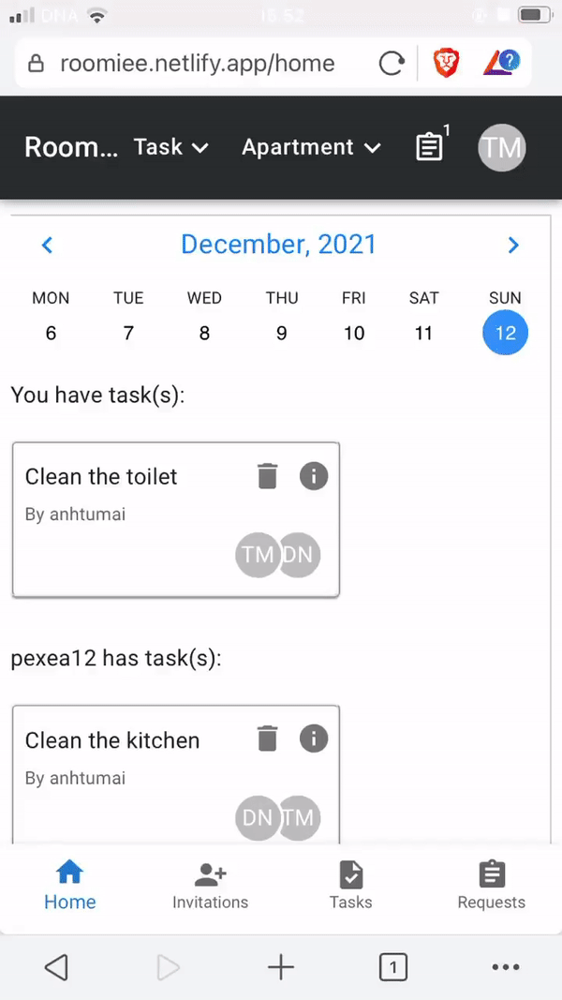
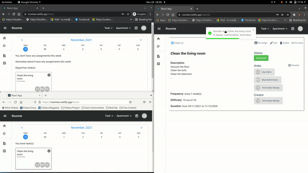

# Roomie frontend

> An app allows roommates in one apartment to share, request and manage task.
> App uses Pusher library to keep all apartment members informed
> with the latest actions by other members.
> Written in React (Typescript)

Link to demo video: [Youtube demo video](https://youtu.be/hB8UYaypeuM)
and [Vimeo demo video](https://vimeo.com/650856424)

Link to demo app: [Netlify link](https://roomiee.netlify.app/)

**Credentials**: You can log in with these usernames and passwords:

- `shmosbey`, `shmosbeypassword` (Ted Evelyn Mosby)
- `marshmallow`, `marshmallowpassword` (Marshal Eriksen)
- `lilypad`, `lilypadpassword` (Lily Aldrin)

Link to backend repo: [Backend app](https://github.com/anhtumai/roomie-backend)

## App is responsive



## Overview

App workflow:

- First, after logging in, user can choose to create a new apartment
  or wait for invitations.
  The person who creates the apartment with the apartment form will become admin.

- After creating a new apartment, user can click Apartment => Invite from the header
  to open Invite Dialog, to invite your roommates.

- User can go to /invitations by clicking the "Invitations" button
  from the Sidebar to check sent and received invitations

- User can create the new task and assign it to roommates by clicking Task => Create
  from the header

- After that, the task is "Requesting". Every assignee must accept the task
  before it can be assigned. Click the "Requests" button from the Sidebar to
  accept/reject the task.

  (The reason is all assignees must read and approve the task before it can be assigned)

- User can check the status of the task by viewing the task page. To navigate to
  a task page, click the **exclamation** mark in the task card.

- Only **task creator** and **admin** can edit, re-order and re-assign the task.

- If a task is **reassigned**, it will have "Requesting" status
  (even though it was assigned before). Check

- After a task is assigned, all apartment members can find it in the big calendar
  on the Home page.

## Installation

```bash
$> git clone git@github.com:anhtumai/roomie-frontend.git
$> cd roomie-frontend
$> npm install
```

### Run

```bash
$> npm start
```
